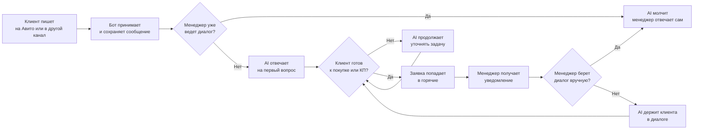
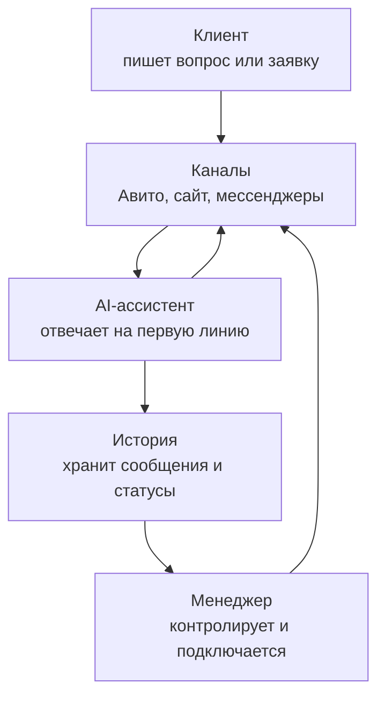
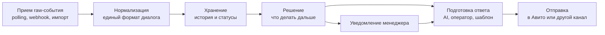

# Как работает avito-bot

`avito-bot` помогает бизнесу не терять входящие заявки. Он принимает сообщения
клиентов, отвечает на простые вопросы через AI, выделяет горячие заявки и
передает менеджеру диалоги, где нужен человек.

## Простая схема

## Что видит пользователь

Менеджер открывает рабочий экран и видит список диалогов по объявлениям. В
каждом диалоге видны сообщения клиента, ответы AI, статус заявки и кнопка
ручного режима.

Если клиент пишет обычный вопрос, например про сроки или цену, AI отвечает сам
по заданным правилам. Если клиент пишет что-то вроде "хочу КП", "готов купить",
"хочу сделку" или просит менеджера, заявка выделяется как горячая, а менеджер
получает уведомление.

## Основной сценарий

1. Клиент пишет в Авито, мессенджер, соцсеть или чат на сайте.
2. Система сохраняет сообщение и показывает его менеджеру.
3. Если ручной режим не включен, AI готовит или отправляет первый ответ.
4. AI уточняет только важные детали и не спорит с клиентом.
5. Когда клиент показывает интерес к покупке, КП или сделке, система помечает
   диалог как горячий.
6. Менеджер получает уведомление и видит причину: например запрос КП, сделка,
   покупка, жалоба или просьба позвать менеджера.
7. Менеджер может включить ручной режим в любой момент.
8. После включения ручного режима AI перестает писать в этот диалог.
9. История сообщений сохраняется, чтобы менеджер видел весь контекст.

## Роли

## Важно: система должна быть модульной

Получение сообщения, понимание сообщения и отправка ответа - это разные части
системы.

Это нужно, чтобы потом можно было заменить один способ ответа другим. Например,
сегодня отвечает AI, завтра менеджер вручную, послезавтра готовый шаблон или
простое правило автоответчика. Прием сообщений от Авито при этом не должен
переписываться.

## Главное правило

AI помогает менеджеру, но не заменяет его полностью. Он отвечает на типовые
вопросы, не дает клиенту ждать и собирает первичную информацию. Как только
нужна сделка, КП, сложное решение или человеческое участие, система привлекает
менеджера.

## Когда AI должен остановиться

AI не пишет клиенту, если менеджер включил ручной режим. Это главное защитное
правило: после ручного переключения клиент общается только с человеком.

## Что считается хорошим результатом MVP

- входящие сообщения попадают в систему;
- AI отвечает на простые вопросы;
- горячие заявки выделяются отдельно;
- менеджер получает уведомление;
- менеджер видит всю историю диалога;
- менеджер может вручную забрать любой диалог;
- после ручного режима AI больше не отвечает в этом диалоге.
