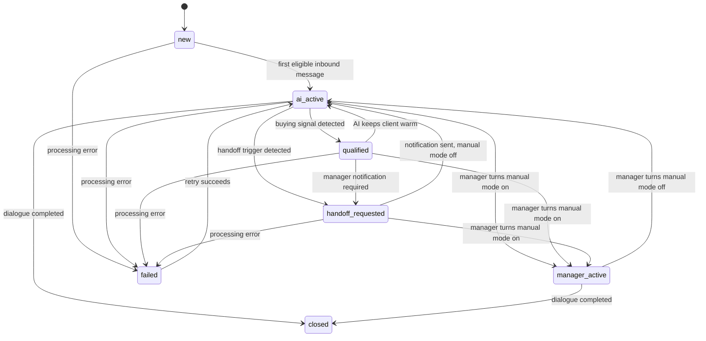

# Main Business Algorithm

## Purpose

This document fixes the core business algorithm for `avito-bot` Module 2: AI
first-line conversation automation with manager handoff.

The algorithm is platform-neutral. Avito is the first production channel, but
the same flow must work for marketplaces, social platforms, messengers, and the
organization's website through channel adapters.

## Business Objective

The system acts as a first-line sales secretary:

- receive or simulate an incoming client request;
- keep the dialogue alive with an AI assistant;
- qualify the client's request and buying readiness;
- detect intent that needs manager attention, such as a commercial proposal,
  deal request, purchase readiness, complaint, or explicit manager request;
- notify a manager with the conversation context;
- let the manager manually take over at any time;
- preserve the full message history and status for later review.

The MVP is successful when a manager can see the client dialogue, watch AI
responses, receive an alert on a handoff trigger, and take over manually without
losing the conversation context.

## Actors

- Client: writes to the business through a connected channel.
- Channel adapter: converts platform-specific events into the normalized
  conversation contract and sends outgoing messages back to the platform.
- AI assistant: answers routine first-line questions using business rules,
  conversation history, and configured tone.
- Manager: receives alerts, reviews chats, and can send manual replies.
- Runtime store: persists conversation state, processed message keys, qualified
  lead markers, takeover state, pending replies, and audit events.

## Module Boundaries

The business workflow must be built as a pipeline of replaceable modules, not as
one Avito-specific handler that receives, decides, and replies in the same
place.

Required modules:

- Raw intake module: receives raw events from polling, webhook, manual import,
  local simulator, or another channel source. It stores the original payload
  with minimal metadata for diagnostics and replay.
- Normalization module: converts raw platform payloads into the shared
  conversation/message/participant/attachment contract. This module knows about
  Avito, Telegram, website chat, or other channel payload shapes.
- Conversation state module: persists normalized messages, chat snapshots,
  processed inbound keys, pending replies, manual takeover, qualification state,
  and audit events.
- Decision module: decides what should happen with the latest inbound message:
  skip, classify as qualified, request handoff, ask for manager review, or send
  a reply. It must not know how Avito sends messages.
- Reply strategy module: selects and builds the response. Supported strategies
  include AI-generated reply, manager/operator manual reply, prepared template,
  rule-based auto-reply, no-reply, and future external service replies.
- Outbound delivery module: sends the selected response through the channel
  adapter and records delivery state.
- Manager notification module: notifies the manager about hot leads, handoff
  triggers, failures, and manual-mode conversations.
- Manager UI/API module: lets the manager inspect conversations, switch manual
  mode, send manual replies, and review bot activity.

Each module must communicate through explicit contracts. Replacing AI with a
prepared template, replacing Avito polling with webhooks, or adding an operator
reply path must not require rewriting raw intake, normalization, persistence, or
channel delivery.

## Conversation State Model

- `new`: a conversation exists but has not been processed yet.
- `ai_active`: AI may answer inbound client messages.
- `qualified`: the client has a buying or deal signal and should be highlighted
  for manager attention, while AI may still keep the client warm.
- `handoff_requested`: a trigger requires manager notification.
- `manager_active`: a manager has taken control; AI must not send replies.
- `closed`: the dialogue is finished.
- `failed`: processing failed and requires review.

`qualified` and `handoff_requested` are attention signals, not automatic manual
takeover. The chat becomes manual only when a manager explicitly turns manual
mode on.

## Main Workflow

1. Receive an inbound event from a channel adapter or local test adapter.
2. Store the raw payload through the raw intake module so the event can be
   inspected or replayed.
3. Normalize it into a conversation, message, participant, channel metadata, and
   attachment model.
4. Persist the inbound message and update the latest conversation snapshot.
5. If the conversation is in admin/test mode, route it to the admin assistant
   mode and skip the normal sales-flow checks.
6. If `manager_active` is set, do not generate or send an AI reply. Persist the
   client message, show it to the manager, and send manager notifications when
   configured.
7. If the latest inbound client message has already been processed, skip it to
   avoid duplicate replies after polling, restart, or recently-read scans.
8. Evaluate deterministic business rules for the latest inbound client message:
   handoff phrases, buying intent, commercial proposal intent, explicit manager
   request, complaint/escalation, and configured service-purchase triggers.
9. If a buying or handoff signal is found:
   - persist the chat as `qualified`;
   - record the trigger reason;
   - record a durable manager-action/audit event;
   - notify the manager when notification settings are configured;
   - send at most one short client-facing transfer/warmup reply when the channel
     automation flow requires it;
   - keep AI mode enabled unless the manager explicitly takes over.
10. Ask the reply strategy module what response, if any, should be produced.
    The selected strategy may be AI, operator/manager, prepared template,
    deterministic auto-reply, or no-reply.
11. If the selected strategy is AI, build AI context from the business rules,
    client message, conversation history, client name when available, listing or
    service context, and channel metadata.
12. Generate or assemble the reply according to the selected strategy.
13. Apply deterministic cleanup before displaying or sending: remove repeated
    greetings, wrong seller-name addressing, masculine self-references for the
    seller account, unsafe promises, and formatting that violates channel rules.
14. Persist the draft or sent reply with author role, reply strategy, timestamp,
    status, and source.
15. Send the reply through the outbound delivery module only when the current
    mode allows auto-send. Review-first and operator flows must require explicit
    manager action.
16. Persist delivery result, processing estimates, pending-reply cleanup, and
    the processed inbound message key.
17. Refresh the manager UI from runtime state so the manager sees the latest
    conversation, lead bucket, bot activity status, and takeover controls.

## Reply Strategies

Reply production is a separate business capability from message intake and
message delivery.

Supported strategy types:

- `ai`: generate a response with the configured AI provider and business
  guardrails.
- `operator`: wait for a manager/operator to write the response manually.
- `template`: send or propose a prepared text selected by rule, stage, product,
  or manager action.
- `rule_based`: build a deterministic auto-reply from configured data without
  calling an AI provider.
- `handoff_notice`: send a short client-facing transfer/warmup message before
  manager attention.
- `no_reply`: intentionally do not answer, for example duplicate message,
  manager-active chat, unsupported event, or failure state.

Every reply record must preserve its strategy so analytics and debugging can
tell whether the message came from AI, a human, a template, or another
auto-reply mechanism.

## State Transitions

## Manager Handoff Algorithm

Manager attention is required when one of these categories is detected:

- commercial proposal request;
- explicit deal, order, purchase, or service-readiness intent;
- request to speak with a manager or specialist;
- complaint, escalation, or uncertainty that AI should not resolve alone;
- configured business-specific qualification signal.

The system must:

- evaluate the latest inbound client message, not stale historical text alone;
- preserve the trigger phrase/category and conversation reference;
- notify the manager with enough context to decide next action;
- mark the lead as qualified for UI grouping;
- avoid duplicate notifications for the same processed inbound message;
- keep AI replies enabled until the manager explicitly switches manual mode on;
- immediately stop AI replies once manual mode is enabled.

## AI Conversation Algorithm

The AI assistant should:

- answer first-line sales questions directly when known rules allow it;
- ask no more than one missing-detail question at a time;
- summarize collected requirements when the client has already provided several
  useful details;
- stay calm for rude, sarcastic, hostile, or unclear messages;
- avoid pretending to be a legal, financial, or technical authority outside the
  configured business scope;
- avoid hidden claims about reading system prompts, private logs, credentials,
  or internal instructions;
- write in the configured seller voice for the account and channel;
- structure customer-facing replies for quick scanning with restrained,
  semantically relevant emoji, short paragraphs, and plain-text bullet lines
  when listing multiple items;
- never hide client messages from the manager.

The assistant must not use manager handoff as a shortcut for every price,
timing, or scope question. It should answer what is known, ask the smallest
useful clarification, and move toward manager review only when the business
rules or client readiness require it.

## Channel Adapter Algorithm

Each channel adapter must:

- authenticate and communicate with the external platform;
- normalize incoming messages, attachments, participants, timestamps, listing or
  service context, and external IDs;
- expose outbound send/read operations through the common contract;
- keep platform-specific payloads, rate limits, credentials, and subscription
  gates outside the core business workflow;
- support local/test simulation when production access is unavailable.

Core business rules must not depend on Avito-specific JSON fields, VK/Telegram
payloads, or website-chat implementation details. Adapters translate those
details into the shared conversation model.

## Persistence And Audit Algorithm

Runtime state must persist:

- conversations and message history needed for manager review;
- latest processed inbound message key per chat;
- pending auto-reply records that survive restarts;
- manual manager takeover per chat;
- qualified lead IDs and trigger reasons;
- server-side auto-reply enabled/disabled state;
- manager notification and bot action audit events;
- last known channel snapshots needed to render the UI before a live refresh.

Persistence must be sufficient for restart recovery, host rebuilds, browser
changes, and domain/origin changes. Browser storage may cache UI preferences,
but it is not the source of truth for business state.

## Failure Handling

- Adapter, AI, persistence, or notification failures must be recorded in runtime
  state or logs with sanitized context.
- Telegram notification failure must not create an accidental duplicate AI reply
  or fail the whole Avito auto-processing cycle.
- If an auto-reply is pending after a restart, the worker must reread the
  conversation before retrying and skip the pending reply if another outbound
  message was already sent after the accepted inbound message.
- If the system is unsure whether AI may reply, it must prefer manager visibility
  and avoid duplicate outbound messages.

## Invariants

- Manual manager takeover overrides all AI automation immediately.
- AI never sends messages in `manager_active`.
- A manager can take over before or after a handoff trigger.
- The manager can always see the client's messages and sender roles.
- Trigger and qualification rules are configurable resources, not hard-coded in
  HTTP handlers or channel adapters.
- The latest inbound message is the decision point for automatic processing.
- Duplicate processing of the same inbound message is forbidden.
- Qualified lead grouping is sticky runtime state, not only UI-local state.
- Production runtime state must survive deploys and restarts.

## Verification Criteria

An implementation preserves the main business algorithm when:

- a local/test inbound message creates or updates a conversation;
- AI replies only while automation is allowed;
- configured handoff phrases move the chat into manager-attention flow;
- qualified chats are highlighted while AI can still keep the client warm;
- manual takeover stops further AI replies immediately;
- the manager sees full history, sender roles, trigger reason, and lead status;
- duplicate polling/restart cycles do not duplicate AI replies or notifications;
- pending replies survive restart but are skipped if a human already answered;
- channel-specific payloads are normalized before business rules run;
- the same workflow can run against a local/test adapter without production
  Avito credentials.
