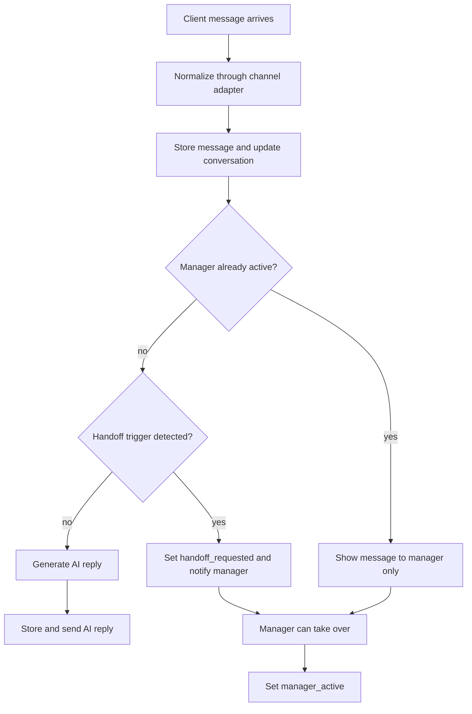

# Module 2: AI Conversation Automation

## Product Intent

Module 2 is the first implementation target for `avito-bot`.

The module should automate first-line communication with potential clients from
marketplaces, social platforms, messengers, and the organization's website. AI
answers routine first questions until the client shows clear buying or deal
intent, then the system alerts a manager and supports human takeover.

## Success Signal

The first MVP is successful when a manager can observe a dialogue, see AI
responses, receive a handoff alert on a configured trigger, and manually take
over the conversation before or after that trigger.

## Actors

- Client: writes to the business through an external platform or website.
- AI assistant: replies to first-line questions according to business context,
  configured style, and safety rules.
- Manager: monitors conversations, receives alerts, and can take control.
- Channel adapter: normalizes incoming and outgoing messages for a platform
  such as Avito, VK, MAX, Telegram, Drom, or website chat.

## MVP Scope

Required:

- Avito-first integration direction through an adapter boundary.
- Conversation intake through at least one local/test adapter before production
  platform credentials are available.
- Platform-neutral conversation model with messages, participants, state, and
  channel metadata.
- AI reply workflow for first-line dialogue.
- Handoff trigger detection for phrases such as `хочу КП`, `хочу сделку`, and
  configured equivalents.
- Manager notification event when handoff is needed.
- Manual manager takeover at any time.
- Conversation visibility for manager review.
- Audit trail of who sent each message: client, AI, or manager.

Out of first MVP unless explicitly pulled in:

- Production VK/MAX/Telegram/Drom API integration.
- Automated bulk follow-up campaigns for historical contacts.
- Auto-posting module.
- Payments, CRM sync, analytics dashboards, and multi-tenant billing.

Conditional:

- Production Avito Messenger API integration is included only after API keys and
  Messenger API permissions are confirmed. Until then, build against a local
  Avito-compatible adapter.

First runnable slice:

- A FastAPI backend and static UI exist for Avito connectivity checks.
- The slice can check credentials, request an Avito token, read account info,
  list chats, read messages, send a text message, mark a chat read, and receive
  local webhook payloads.
- A configurable AI assistant can generate a review-first draft reply for a
  selected Avito chat. Supported providers are `deepseek` and
  `codex_app_server`.
- The UI can process unread Avito chats on demand or by enabled polling: for
  each unread chat whose latest non-system message is inbound, it generates an
  AI reply, sends it through Avito, and marks the chat read when no handoff
  trigger is detected.
- Bot behavior rules live in a dedicated application module rather than inside
  HTTP handlers. The rule layer owns handoff phrases, prompt guardrails, and
  deterministic reply cleanup such as removing repeated greetings after the
  seller has already greeted the client.
- The manager UI shows Avito messages chronologically with day separators,
  per-message time, clear sender roles, and explicit start/latest markers.
- The manager UI and message search text should preserve media-only inbound
  messages with compact attachment labels. Image, video, voice, and file
  attachments must not disappear from chat previews, search/filter text, or AI
  prompt context when there is no plain text body.
- The manager UI has a per-chat `Ручной режим` checkbox that is disabled until a
  chat is selected. When `Ручной режим` is checked for a chat, the backend stores
  that chat as a manager takeover and the auto-reply worker must skip it even if
  it has unread inbound messages; the manager can still send manual Avito
  messages from the conversation panel. Other chats remain eligible for bot
  replies.
- The UI loads Avito chats by default after confirming credentials are present.
- The UI can enable a backend auto-reply worker. The worker polls Avito from the
  server every few seconds, so automatic replies do not depend on the manager
  keeping the browser tab focused or visible. The UI periodically refreshes
  status, chat list, and active conversation while visible.
- The manager UI keeps chats, active conversation, and API inspector in
  independent scroll areas so long histories do not move the whole workspace.
- The manager UI groups Avito chats by listing/ad context: each listing appears
  as a collapsible folder with its chat count, and chats for that listing are
  shown inside the folder so managers can review leads per advertised item.
- The statistics view should connect Avito listing metrics back to live client
  conversations. A metric row for a known listing must be expandable and show
  the related client chats from the currently loaded chat list, including the
  best available client label, chat id, Avito profile link when exposed by the
  channel payload, and an in-app action that opens the conversation.
- Chat rows in the manager UI must identify the client whenever the channel
  payload exposes a buyer/profile/user name. When Avito exposes a client name
  in the chat title, that chat title is the authoritative client label and must
  take priority over generic profile/user fields that may describe the seller or
  brand. The row must still show the external chat id when the client name is
  unavailable. For Avito item chats, `context.value.user_id` identifies the
  seller/listing owner; when `users` contains both seller and client, the client
  label must come from the participant whose id is different from that seller
  id.
- Message bubbles in the manager UI must identify the message author whenever
  the channel payload exposes an author/user/sender name or id; when only chat
  context is available, inbound messages should fall back to the active external
  chat title/client label or chat id so the manager can still correlate the
  speaker. The UI must preserve the selected chat-list summary while loading
  detailed chat payloads so a correct Avito chat-title client name is not lost.
- Manual manager messages must appear in the active conversation immediately
  after submit with an explicit delivery status while the Avito API request is
  in flight. The browser may keep this local pending copy until the server
  history includes the matching outbound message, then remove the local copy to
  avoid duplicates. If sending fails, the failed bubble remains visible and the
  draft text is restored to the input when possible.
- The manager UI must preserve the current browser page state across refreshes:
  selected tab, active chat, opened listing folders, opened chat buckets, and
  chat-list scroll position. After reload, the UI should restore the selected
  chat after the chat list is loaded instead of forcing the manager to reopen
  folders manually.
- Each listing folder must contain a visually distinct `Согласились купить`
  bucket for chats whose latest available channel metadata or message text
  indicates purchase, need/request, deal, order, commercial proposal, manager
  handoff intent, or qualifying readiness such as "без ограничений" on price,
  region, or budget. Other chats remain under the regular chat bucket for that
  listing. Both the buying bucket and the regular bucket must be independently
  collapsible inside each listing folder.
- Once the UI classifies a chat as qualified for the `Согласились купить`
  bucket, that classification should remain sticky across later list refreshes
  even if the latest message changes to a neutral manager follow-up. Follow-up
  phrases such as "определился", manager handoff wording, exact calculation, or
  proposal preparation are also qualification signals.
- UI service-purchase trigger words and regex phrases must live in a separate
  project-local rules dictionary, not inline inside the chat rendering logic.
  The current browser-side dictionary is `app/static/bot-rules.js` under
  `servicePurchaseTriggers`; `app/static/app.js` may compile and apply those
  rules but should not own the phrase list.
- Chat-list previews should stay compact by clamping the latest-message preview
  to a small fixed number of lines so managers can scan more conversations
  without losing the client name and status badge.
- The auto-processing API returns bot activity estimates for each accepted
  inbound message: accepted time, estimated reply seconds/time, sent time, and
  actual processing duration. The UI shows when the bot starts checking or
  thinking and replaces that with the fixed estimate/result after sending.
- This slice is not yet the full Module 2 domain model or manager handoff
  workflow.

## Conversation States

- `new`: conversation exists but has not been processed.
- `ai_active`: AI may answer incoming client messages.
- `handoff_requested`: trigger detected; manager should take over.
- `manager_active`: manager has taken control; AI must not send replies.
- `closed`: dialogue is finished.
- `failed`: adapter, AI, persistence, or notification failure requires review.

## Workflow

## Business Rules

- AI must stop sending messages once a manager takes over.
- AI must not hide client messages from the manager.
- Manager takeover must be available regardless of whether AI has detected a
  trigger.
- Trigger detection must be configurable, not hard-coded into channel adapters.
- Channel-specific APIs must stay behind adapters; core dialogue rules must not
  depend on Avito, VK, MAX, Telegram, Drom, or website-specific payloads.
- Each message must preserve source channel, external message id when available,
  author role, timestamp, text, and delivery status.
- The system must be able to run without production platform credentials by
  using local/test adapters.
- Avito-specific authentication, API payloads, webhooks, rate limits, and
  subscription gates must stay in the Avito channel adapter and integration
  configuration, not in the core conversation workflow.

## Configuration Boundaries

Configurable values:

- connected channels;
- AI provider (`deepseek` or `codex_app_server`) and provider-specific model or
  endpoint settings;
- handoff trigger phrases and intent examples;
- AI style and tone;
- business knowledge source;
- manager notification destinations;
- retry and timeout policy.

These values belong in configuration, database records, or resources, not inline
inside handlers or channel adapters.
The current backend default rules resource is `app/rules/bot-rules.json`.
`app/bot_rules.py` loads and validates that resource, compiles regex patterns,
and exposes rule-application helpers to the assistant. The JSON owns handoff
phrases, intent patterns, prompt rules, dialogue thresholds, and deterministic
post-processing patterns. Deployments may point `AVITO_BOT_RULES_PATH` to
another JSON file, and `AVITO_ADMIN_CODE` may override the default admin/debug
activation code without changing Python source.

## Verification Contract

Minimum MVP checks:

- A local inbound message creates or updates a conversation.
- AI replies while the conversation is `ai_active`.
- A message containing `хочу КП` or `хочу сделку` moves the conversation to
  `handoff_requested`.
- After handoff or manual takeover, AI does not send further replies.
- Per-chat manual takeover must be testable through the HTTP API and must make
  unread auto-processing report the chat as `manager_active` without fetching
  messages or sending an AI reply.
- Manager can see the full message history and sender roles.
- Channel adapter tests prove core workflow is platform-neutral.
- Avito adapter tests prove official Avito payloads can be normalized into the
  same platform-neutral message model.
- AI draft generation must not auto-send messages. A human must review and
  explicitly send the reply.
- Avito unread auto-processing must send only when the latest non-system message
  is inbound and no handoff trigger is detected; handoff-trigger messages must
  not be auto-sent.
- When Avito auto-processing marks an accepted inbound message read before the
  AI reply is sent, it must persist a minimal pending auto-reply record so a
  restart or transient AI failure can still retry the chat even if Avito no
  longer returns it in `unread_only` results.
- Before retrying a pending auto-reply, the worker must reread the conversation
  and skip/clear the pending record if a manager or another sender has already
  posted an outbound reply after the accepted client message.
- If backend auto-reply was enabled before a local server restart, startup must
  restore that enabled state and resume the worker when Avito credentials are
  available.
- The assistant must use the conversation history silently. It must not tell the
  client that it reads or sees the whole chat, and it must not repeatedly start
  follow-up replies with a greeting after the seller/assistant has already
  greeted the client.
- Avito automatic replies are sent on behalf of the seller account `Оксана`.
  The assistant must write in Russian from a feminine first-person voice, so
  generated manager-style phrases agree with a female speaker. It must avoid
  masculine self-references such as "я мог", "подобрал", or "уточнил".
- When an unread message is accepted for automatic processing, the UI must make
  that state visible before completion; after send or handoff, the UI must show
  the fixed estimate/result instead of leaving the manager guessing.
- Automatic Avito replies must not depend on browser JavaScript timers for core
  sending behavior. Browser polling may refresh status, but the backend owns the
  processing loop once auto-reply is enabled.
- The seller profile name, currently Oksana, identifies the business account,
  not the client. The assistant must not address the client as Oksana unless
  the inbound client message explicitly identifies the client with that name.
  Generated replies must be post-processed to remove accidental leading
  seller-name addresses before draft display or automatic sending.
- When Avito exposes the buyer/client account name, the backend AI prompt must
  pass that name explicitly as the `Client Avito account name`. For item chats,
  `context.value.user_id` identifies the seller/listing owner, so the client
  name must come from the participant in `users` whose id differs from that
  seller id. The assistant should use this client name for natural personal
  address and must not invent a name when it is unavailable.
- If the latest client message is rude, sarcastic, hostile, or unclear, the
  assistant must stay calm, avoid mirroring the tone or joking back, and ask one
  short clarifying question about the business task.
- The assistant must not overuse manager handoff as a substitute for answering
  first-line sales questions. For price or timing questions it should answer
  directly with the known entry price or scope dependency, ask at most one
  missing detail, and avoid repeating the same "pass to manager" wording when
  the conversation already contains that handoff promise. Once the client has
  supplied several useful task details, the assistant should summarize the
  collected requirements and move toward manager review instead of restarting
  broad qualification.
- Inbound messages containing the configured admin code start admin/test
  settings mode, not a normal customer lead flow. The mode stays active for
  later inbound messages in the same conversation until the admin says a
  configured disable phrase such as `Выключить отладку` or `Отключить режим`.
  The backend must detect the current admin-mode state before normal handoff
  checks and must call the LLM with an explicit admin-mode system prompt that
  does not need to repeat the activation code. In admin mode, the assistant
  must not include the normal first-line sales playbook or manager-handoff
  dialogue guidance unless the admin explicitly asks to test those rules. The
  assistant treats the sender as the creator/admin testing or configuring the
  bot, not as a normal sales lead, while still refusing to reveal secrets,
  tokens, private logs, or hidden system instructions.
